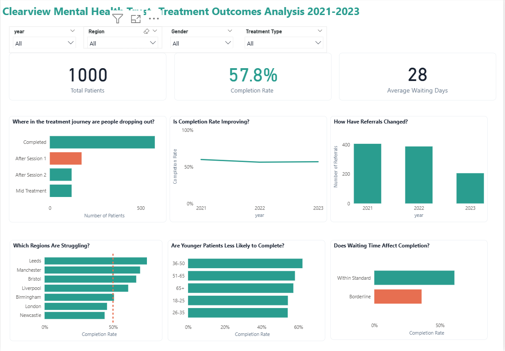

# Clearview Mental Health Trust -  Treatment Outcomes Analysis

## Project Overview

Clearview Mental Health Trust is a fictional NHS-aligned mental health charity created for this portfolio project. The scenario is based on a realistic business problem -patients being referred to mental health services but not completing treatment.

I designed this project to simulate the kind of end-to-end analysis a data analyst would be asked to carry out in a  healthcare setting. 
## Tools Used

- Microsoft SQL Server - data cleaning and analysis
- Power BI - data modelling and dashboard
- DAX -KPI and completion rate measures

---

## Dataset

Synthetic dataset covering January 2021 to December 2023 across four tables - appointments, demographics, referrals and outcomes - containing 1,000 patients and 6,400 appointment records.

---

## Business Questions Answered

1. What is our overall treatment completion rate?
2. Where in the treatment journey are people dropping out?
3. Are certain demographic groups less likely to complete treatment?
4. Does waiting time affect whether someone completes treatment?
5. Which regions are performing well and which are struggling?
6. Are we improving year on year or standing still?
7. Where should we focus our limited resources next quarter?

---

## Key Findings

- Overall completion rate is 57.8% - above the NHS 50% benchmark
- Completion rate has declined slightly year on year from 59.65% in 2021 to 56.80% in 2023
- 17.5% of patients drop out after Session 1 - the single biggest dropout point
- Waiting beyond 42 days drops completion rate by 25 percentage points
- London and Newcastle are the only regions below benchmark and have the highest waiting times
- Younger adults aged 18 to 35 have the lowest completion rates among all age groups

---

## Recommendations

- Investigate Session 1 dropout causes through patient feedback and session review
- Prioritise waiting time reduction in London and Newcastle as the highest impact intervention
- Develop targeted engagement strategies for adults aged 18 to 35

---
[Read the full article on Medium](https://medium.com/@balikisadetoyi75/clearview-mental-health-trust-a-data-analysis-project-of-treatment-dropout-and-what-it-means-for-773c7a8d4e1a)

## Dashboard

## Author

Balikis Adetoyi — Data Analyst

